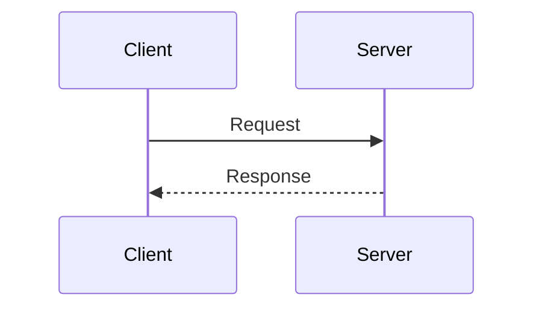
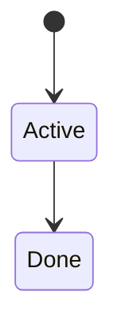
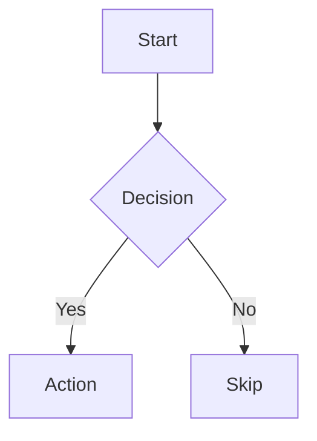

# GitLab Wiki Management

Create and manage wiki pages via `glab api`. GitLab wikis render Mermaid diagrams natively in markdown.

## Setup

Wiki uses `glab api`. Get project path first:

```bash
PROJECT_PATH=$(git remote get-url origin | sed -E 's|.*://[^/]+/||;s|\.git$||' | sed 's|/|%2F|g')
```

## CRUD Operations

### List Pages

```bash
glab api "projects/${PROJECT_PATH}/wikis" | python3 -c "
import sys,json
for w in json.load(sys.stdin):
    print(f'  {w[\"slug\"]:<40} {w[\"title\"]}')
"
```

### Create Page

```bash
glab api "projects/${PROJECT_PATH}/wikis" --method POST \
  --field "title=Page Title" \
  --field "content=# Page Title

Content here. Mermaid works:

\`\`\`mermaid
graph LR
    A --> B --> C
\`\`\`
"
```

### Read Page

```bash
glab api "projects/${PROJECT_PATH}/wikis/<slug>" | python3 -c "
import sys,json
w = json.load(sys.stdin)
print(w['content'])
"
```

### Update Page

```bash
glab api "projects/${PROJECT_PATH}/wikis/<slug>" --method PUT \
  --field "content=# Updated content"
```

### Delete Page

```bash
glab api "projects/${PROJECT_PATH}/wikis/<slug>" --method DELETE
```

## Wiki via Git

GitLab wikis are also git repos. Clone for bulk edits:

```bash
# Clone wiki repo (append .wiki.git to project URL)
REPO_URL=$(git remote get-url origin | sed 's|\.git$|.wiki.git|')
git clone "$REPO_URL" /tmp/wiki-repo

# Edit files locally (each .md file = one wiki page)
cd /tmp/wiki-repo
# ... edit files ...
git add -A && git commit -m "Update wiki" && git push
```

## Mermaid Diagrams

GitLab renders Mermaid in wiki markdown. Use fenced code blocks:

````markdown





````

## Sprint Wiki Template

When creating sprint documentation:

```bash
glab api "projects/${PROJECT_PATH}/wikis" --method POST \
  --field "title=Sprint-YYYY-WNN" \
  --field "content=# Sprint YYYY-WNN

## Goals
- [ ] Goal 1
- [ ] Goal 2

## Issues
| ID | Title | Status |
|----|-------|--------|
| #1 | Task  | To Do  |

## Notes

## Retrospective
### What went well
### What to improve
### Action items
"
```
